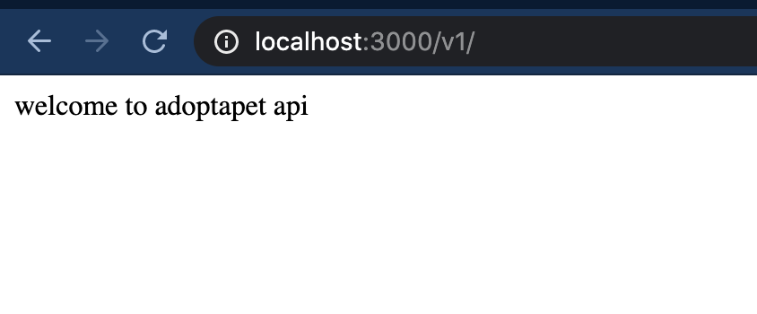

[`Backend Fundamentals`](../../README.md) > [`Sesión 03: API`](../README.md) > `Ejemplo 2`

# Ejemplo 2

## Objetivo

Comprender el concepto de rutas en nuestra API y la mejor manera de establecerlas para acceder a recursos.

## Requerimientos

Se recomienda tener NodeJS LTS y ExpressJS.

## Desarrollo

### Configurando las rutas de nuestra API

Para hacer peticiones en una ruta (endpoint) en específico, debemos establecer una estructura específica.

Para esto utilizaremos el Router que nos provee la librería Express.

1. Dentro de la carpeta routes/ crearemos el archivo `index.js` con el siguiente código:

```jsx
var router = require('express').Router();

router.get('/', (req, res)=>{
  res.send('welcome to adoptapet api');
});

module.exports = router;
```

La sintaxis `(req, res) => { ... }` representa una función que será ejecutada cuando llegue alguna petición en las direcciones uri que especificamos, también se le puede llamar ***handler*** o ***callback***. 

2. Ahora modificaremos nuestro archivo `app.js` para agregar esta ruta:

```jsx
var express = require('express'),
    bodyParser = require('body-parser'),
    cors = require('cors');

// Objeto global de la app
var app = express();

// Configuración de middlewares
app.use(cors());
app.use(bodyParser.urlencoded({ extended: false }));
app.use(bodyParser.json());

**// Agregamos el código de nuestro router (routes/index.js)
app.use('/v1', require('./routes'));**

// Interceptando los errores 404
app.use(function(req, res, next) {
  var err = new Error('Not Found');
  err.status = 404;
  next(err);
});

// Iniciando el servidor...
var server = app.listen(process.env.PORT || 3000, function(){
  console.log('Escuchando en el puerto ' + server.address().port);
});
```

Al hacer una petición a esta ruta podremos ver que nos está devolviendo información sobre la versión uno de nuestra API.



Es una buena práctica colocar la versión de nuestra app como una ruta principal, ya que así en un futuro si hay un cambio demasiado grande puede mantenerse funcionando ambas apis y conservar compatibilidad.

3. Crearemos la siguiente estructura de archivos en nuestra carpeta `routes`:

routes/

anunciantes.js

index.js

solicitudes.js

usuarios.js

mascotas.js


4. En el archivo `index.js` añadiremos lo siguiente

```jsx
var router = require('express').Router();

router.get('/', (req, res)=>{
  res.send('welcome to adoptapet api');
})
router.use('/usuarios', require('./usuarios'));
/* con el método use de nuestro router estamos indicando 
* que en la ruta 'v1/usuarios' estarán anidadas las rutas 
* que vamos a crear en nuestro archivo usuarios.js,
* la función require está importando este archivo */

module.exports = router;
```

### Creando la estructura de un CRUD

En los siguientes pasos crearemos el **esqueleto** de nuestra API para el recurso `usuarios`, declarando las rutas para crear, obtener, actualizar y eliminar usuarios (CRUD).

Los siguientes *endpoints* estarán siendo importados en el archivo `index.js` y bajo la ruta `v1/usuarios` de nuestra api.

5. Para establecer las rutas de los usuarios también utilizaremos el router de ExpressJS. Para la obtención de nuevos usuarios utilizaremos el método get, así que *mapearemos* esa ruta dentro de nuestro archivo `usuarios.js`

```jsx
// usuarios.js Estructura del CRUD
var router = require('express').Router();

router.get('/', (req, res) => {
  // código para consultar usuarios de la DB (próximamente...)
  res.send('Todos los usuarios');
})
router.post('/', (req, res) => {
  // código para crear el nuevo usuario en la DB (próximamente...)
  res.send('Usuario creado');
})
router.put('/:id', (req, res) => {
  // código para crear el nuevo usuario en la DB (próximamente...)
  res.send('Usuario modificado');
})
router.delete('/:id', (req, res) => {
  // código para crear el nuevo usuario en la DB (próximamente...)
  res.send('Usuario eliminado');
})

module.exports = router;
```

6. Leyendo parámetros.

Si necesitamos eliminar o modificar un usuario en específico debemos solicitar su identificador único (`id`).

para leer ese id modificaremos el método PUT y el método DELETE de nuestros usuarios.

```jsx
...
router.put('/:id', (req, res) => {
  var id = req.params.id;
  // código para crear el nuevo usuario en la DB (próximamente...)
  res.send(`Usuario ${id} modificado`);
})
router.delete('/:id', (req, res) => {
  var id = req.params.id;
  // código para crear el nuevo usuario en la DB (próximamente...)
  res.send(`Usuario ${id} eliminado`);
})
...
```

7. Revisa que tu archivo usuarios.js haya quedado similar a esto

```jsx
// Estructura del CRUD
var router = require('express').Router();

router.get('/', (req, res) => {
  // código para consultar usuarios de la DB (próximamente...)
  res.send('Todos los usuarios');
})
router.post('/', (req, res) => {
  // código para crear el nuevo usuario en la DB (próximamente...)
  res.send('Usuario creado');
})
router.put('/:id', (req, res) => {
  var id = req.params.id;
  // código para crear el nuevo usuario en la DB (próximamente...)
  res.send(`Usuario ${id} modificado`)
})
router.delete('/:id', (req, res) => {
  var id = req.params.id;
  // código para crear el nuevo usuario en la DB (próximamente...)
  res.send(`Usuario ${id} eliminado`)
})

module.exports = router;
```

Si es así no olvides guardar y revisar que tu servidor se haya actualizado y esté corriendo.
